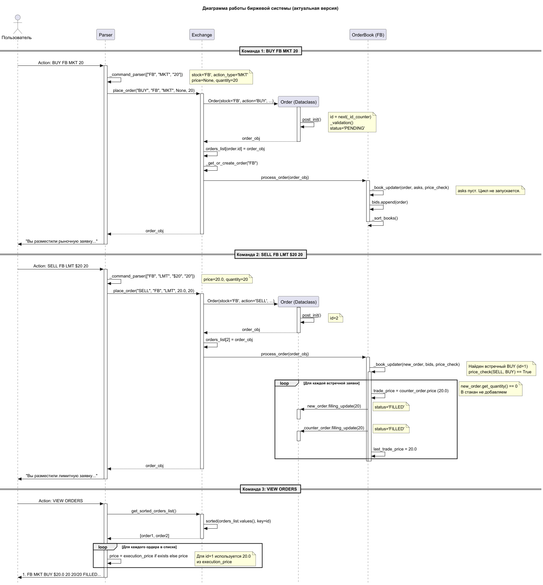

# Simple Stock Exchange

Симулятор биржевой торговли на Python. Программа позволяет выставлять заявки на покупку и продажу акций через консольный интерфейс.

# Структура проекта

Проект организован по модульному принципу:

* **src/** — исходный код.
    * `main.py` — запуск приложения и цикл обработки команд.
    * `exchange.py` — управление списком доступных инструментов и распределение заявок.
    * `order_book.py` — ядро биржи (matching engine) и хранение очередей заявок.
    * `order.py` — описание моделей данных для ордеров.
    * `parser.py` — логика разбора текстовых команд пользователя.
* **tests/** — автоматические тесты.
    * `test_emulating_task_scenario.py` — полная проверка сценария.
    * `test_order.py` и `test_parser.py` — модульные тесты компонентов.

## Требования

* Python 3.10 или выше
* Pytest (для запуска тестов)

## Инструкция по запуску

Для работы требуется Python 3.10 или выше.

### 1. Подготовка
Создай виртуальное окружение и установи зависимости для тестов:
```bash
python -m venv venv
# Активация для Windows:
venv\Scripts\activate
# Активация для macOS/Linux:
source venv/bin/activate

pip install pytest
```
### 2. Запуск программы
```bash
python src/main.py
```
### 3. Запуск тестов
```bash
pytest
```
## Использование

Ввод команды осуществляет после появления строки Action:

* **Лимитная заявка:** (Покупка/продажа + название акции + тип заявки (Лимитная) + $цена + количество)
>BUY SNAP LMT $30 100
* **Рыночная заявка:** (Покупка/продажа + название акции + тип заявки (Рыночная) + $цена + количество)
>BUY FB MKT 20
* **Просмотр статусов:**
>VIEW ORDERS
* **Котировки:** (QUOTE + Название акции)
>QUOTE SNAP
* **Выход:**
>QUIT

## Логика исполнения заявок
Программа использует механизм Matching Engine. Он работает по следующим правилам.

1. **Price-Time Priority.** Заявки с лучшей ценой исполняются первыми. Если цены равны, приоритет у более ранней заявки.
2. **Лимитные заявки.** Сохраняются в книге ордеров. Исполняются сразу, если цена покупки выше или равна лучшей цене продажи.
3. **Рыночные заявки.** Исполняются мгновенно по текущим ценам в книге ордеров.
4. **Статусы.** Заявка меняет статус с PENDING на PARTIAL при частичном заполнении и на FILLED при полном завершении сделки.
## Наглядный пример работы

## Архитектурные решения

* **SOLID.** Код разделен на классы с четкими зонами ответственности. Модуль сопоставления отделен от интерфейса ввода и хранения данных.
* **Обработка ошибок.** Программа валидирует ввод пользователя. Она не завершает работу при получении некорректных данных или пустых котировок.

## Тестирование

Тесты написаны с использованием библиотеки Pytest. Проверены основные и пограничные случаи.

* Мгновенное исполнение при встречных лимитных заявках.
* Исполнение рыночной заявки по нескольким уровням цен.
* Сохранение остатка объема при частичном исполнении.

Для запуска тестов введи:
pytest